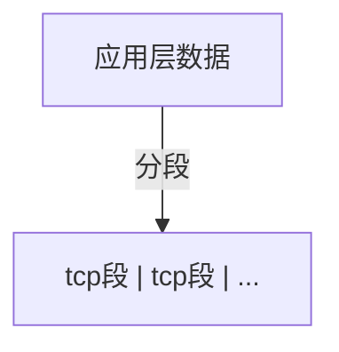
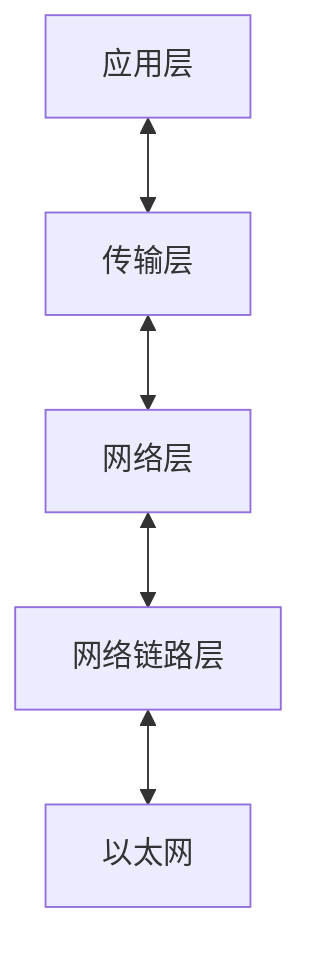
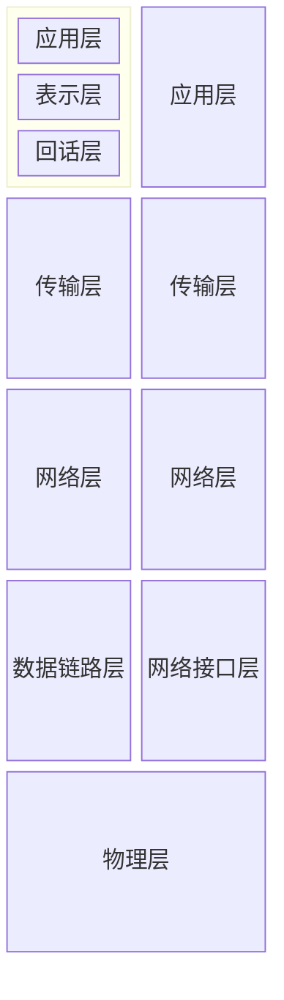

# 小林coding基础篇

## TCP/IP网络模型有哪几层？

### 应用层

- 应用层为用户提供应用服务，如HTTP,FTP,Telnet,DNS,SMTP
- 与数据如何传输无关
- 工作在操作系统中的用户态，传输层工作在内核态

### 传输层

应用层的数据包会传给传输层，传输层为**应用层提供网络支持**

传输层有两个协议：

1. TCP：传输控制协议（transmission Control Trotocol）
   - 相比于UDP多出的特性：流量控制、超时重传、拥塞控制
   - 保证数据包可靠的传输

2. UDP:只负责发送数据
   - 不保证能够抵达
   - 但 实时性高,传输效率高
   - 也可以实现可靠传输，但是需要在应用层实现tcp的特性

应用传输的数据可能非常大，传输层的数据包大小大于MSS（tcp的最大报文段），传输层就会将数据分段，然后交给网络层,每个段就是TCP段（tcp segment），那个分块发送失败，就会重新发送那个分块。

设备作为接收方时，传输层负责把数据包传给应用，但是一个设备可能有很多应用在接受和传输数据，因此使用端口来编号，传输层的报文中包含端口。

### 网络层
**实际传输功能实现**在网络层，负责将数据从一个设备传输到另一个设备。
**最常用的IP协议**，IP协议会将传输层的报文作为数据部分，再加上IP包头组层IP报文，如果报文大小超过MTU（一般1500字节），就会进行分片。

网络层-----》传输层《-------》应用层

#### 如何找到对方设备呢？ 分区设备的编码

**IP地址对设备进行编码**: 对于ipv4，ip地址32位，分四段，每段时八位，分成两种含义

- 一个是**网络号**：识别是那个**子网**的
- 一个是**主机号**：负责同一子网下的不同主机

#### 具体怎么分：配合子网掩码
例如：10.100.122.0/24
/24 表示255.255.255.0 子网掩码
与ip进行**按位与**
00001010 01100100 01111010 00000010 <----ip
11111111 11111111 11111111 00000000 <----子网掩码
**00001010 01100100 01111010 00000000**  <----网络号
**00000000 00000000 00000000 00000010**  <----主机号

**先匹配网络号，再寻找对应主机**，除此之外，ip协议还有一个重要功能就是**路由**
实际场景中，两台机器不是通过网线连起来的，而是通过很多网关、路由器、交换机等设备，形成很多网络路径，当数据通过一个网络节点，需要通过**路由算法决定何去何从**

### 网络接口层
网络接口层---》网络层《---》传输层《---》应用层
ip头部中包含的**接收方ip地址，表示网络包要到达的目的地，通过这个来判断包要发送到哪里**，但是再以太网的世界是**行不通**的，为什么？
#### 以太网
以太网就是在 局域网 内，将附近的设备连接起来，是他们之间可以进行通信的技术。

以太网在判断网络包目的地是和ip的方式不同，必须使用**MAC地址**

MAC头部包含了接收方和发送方的MAC地址信息，可以通过**ARP协议**获取对方的地址

所以，**网络接口层主要为网络层提供 链路级别 传输的服务，负责在以太网、wifi这样的底层网络上发送原始数据包**

可以通过`arp -a`查看arp缓存

每一层的封装格式

## Linux是如何收发网络包的

### 网络模型
开放式系统互联网络通信参考模型------OSI模型
共有七层，对比tcp的四层

这个层级说法有点儿不统一。对于**接收方**来说**二层指的是链路层，三层是网络层**，也不知道到底是哪一层，可能正这来反着来序号也会跟着反

所谓的四层（传输层）和七层（物理层）负载均衡值得都是OSI模型

### linux网络协议栈

- 应用程序需要通过系统调用来跟socket层进行数据交互
- socket层的下一层就是传输层、网络层和网络接口层
- 最下面一层则是网卡驱动程序和硬件网络设备

### linux接收网络包的流程

网卡负责接收和发送网络包，当网卡接收到网络包以后，会通过DMA技术，将网络包写入Ring Buffer，这是一个环形缓冲区，接着告诉操作系统这个网络包已经到达。

> 如何告诉系统？

最简单的方式就是**触发中断**，但是存在一个问题：在高性能网络成惊吓，网络包的数量非常多，就会频繁触发中断，cpu忙于处理中断就会影响系统的整体效率

所以Linux内核2.6版本引入**NAPI机制**，它是混合**中断和轮询**的方式接收网络包，核心是**不采用中断的方式读取数据**，而是**首先采用中断唤醒数据接收的服务程序，然后poll的方法来轮询数据**

**总的来说**：当网络包到达以后，会通过DMA技术，将网络包写入指定的内存地址，然后网卡向cpu发起硬件中断，cpu接收到请求后根据中断表，调用已经注册的中断处理函数

- 硬件中断处理函数会做如下内容：

  - 需要先暂时屏蔽中断，表示已经知道内存中有数据了，告诉网卡下次再收到数据包直接写入内存就可以了，不再需要通知cpu，避免cpu频繁被中断
  - 接着发起软中断，恢复刚才被屏蔽的中断

- 软中断处理
  内核中的ksoftirpd线程专门负责处理软中断，会轮询处理数据，重Ring Buffer中获取一个数据帧用sk_buff

  表示，从而可以作为一个网络包交给网络协议栈逐层处理

- 网络协议栈

  - 首先会进入**网络接口层**，检查报文的合法性，如果不合法则丢弃，合法则找出这个包的上层协议类型（是ipv4还是ipv6），接着去掉帧头和帧尾，交给**网络层**
  - 到了**网络层**， 则取出IP包，判断网络包的下一步去向，是交给上层处理还是转发出去，当确认网络包要发给本机以后，就会中IP头看上一层的协议类型是TCP还是UDP，接着去掉IP头，交给传输层
  - **传输层**取出TCP或者UDP头，根据四元组「源 IP、源端口、目的 IP、目的端口」作为标识，找出相应的Socket，并把数据放到Socket缓冲区
  - 最后，**应用层**调用socket接口，将内核socket接收缓冲区的数据拷贝到应用层缓冲区，然后唤醒用户线程

至此，网络包的接收过程就结束了

### Linux发送网络包的流程

- 应用程序会调用socket发送数据包的接口，由于用户会陷入到内核态的socket层，内核会申请一个内核态的sk_buff内存，将用户待发送的数据拷贝到sk_buff,并将其加入到发送缓冲区
- 网络协议栈从socket取出sk_buff，并按照TCP/IP协议栈从上往下处理

如果使用的是TCP，内核在每次调用网卡发送之前会先**拷贝一个sk_buff副本**，实际传递的是**副本**，等接受到对方的ACK之后在真正删除

> 因为网卡发送完会释放sk_buff？所以呢，他留着还有什么其他的用处？
>
> 后面讲到了，层层处理的都是这个sk_buff,依靠这个结构体里的data指针移动来实现添加头部和去除头部

- sk_buff填充tcp的头部，在不同不层级有不用的名字
  - 应用层叫data
  - tcp层叫segment
  - ip层叫packet
  - 数据链路层叫frame

发送报文是，sk_buff结构体中data指针的移动过程：

至此，传输层的任务完成了

- 网络层会选取路由、填充ip头、netfilter过滤、切片，然后交给网络接口层
- 网络结构层会通过ARP协议获得下一跳的MAC地址，然后对sk_buff填充帧头和帧尾，接着将sk_buff放到网卡的发送队列中
- 完成准备工作后，会触发软中断，告诉网卡驱动有网络包需要发送，驱动程序会从队列中读取sk_buff，挂到Ring Buffer中，接着将sk_buff数据映射到网卡可以访问的DMA区域，最后触发真实的发送
- 发送完成后需要清理内存，网卡会触发一个硬中断来释放内存，是要是释放sk_buff 和Ring Buffer
- 当接收到TCP报文的ACK应答时，传输层就会释放**原始的sk_buff**

#### 发送数据包的过程中涉及了几次内存拷贝？

1. 发送数据系统调用的时候，内核会申请一个内核态的sk_buff内存，**将用户数据拷贝到sk_buff**
2. 在从传输层进入网络层的时候，会**拷贝sk_buff，并将副本发送到网络层**，发送完成就会**释放副本**，原始的skbuff依然保存，在收到TCP报文的ACK应答时，**释放原始skbuff**
3. 当IP层发现skbuff大于MTU是会额外申请skbuff，并**将原来的skbuff拷贝为多个小的skbuff**

## 键入网址到网页显示，期间发生了什么？
### 一、HTTP
1. 浏览器第一步工作就是解析URL
解析URL从而生成发给Web服务器的请求信息。

2. 生产HTTP请求信息
对URL解析以后，浏览器确定了Web服务器和文件名，接下来就是根据这些信息生成HTTP请求消息

**请求报文：** 

请求行 换行

消息头 换行

换行

消息体

**响应报文：**

状态行

消息头（若干个）换行

换行

消息体 

### 二、真实地址查询——DNS

通过浏览器解析URL并生成HTTP消息后，需要委托操作系统将消息发送给Web服务器

在此之前，还需要查询服务器域名对应的IP地址

有一种服务器，**专门保存web服务器域名和ip的对应关系，这就是DNS服务器**

1. 域名的层级关系

在域名中，**越靠右表示的层级越高**

域名后面还有一个隐藏的点，`www.baidu.com.`最后一个点表示根域名，当我们试图访问的时候

域名的层级关系类似一个树状结构：

- 根DNS服务区（.）
- 顶级域DNS服务器（.com）
- 权威DNS服务器（server.com）

根域的DNS服务器保存在互联网中所有的DNS服务器中，这样任何DNS服务器都可以找到并且访问根域服务器，然后顺藤摸瓜找到目标服务器。

2. 域名解析流程
   1. 服务端首先发出一个DNS请求，询问`www.server.com`的IP，并发给本地DNS服务器
   2. **如果本地服务器能够在缓存表里找到，则直接返回询问的IP地址**，否则会询问根服务器，根域名好服务器是最高层级，不直接用于域名解析，但是可以指明方向
   3. 根DNS收到本地DNS请求后，发现是.com的后缀，会发送给本地.com的服务器地址
   4. 本地收到.com地址后向.com顶级服务器询问`www.server.com`的地址
   5. 顶级服务器收到后回复server.com权威服务器地址
   6. 本地继续向权威服务器询问
   7. **权威服务器是域名解析结果的原出处**，将`www.server.com`地址返回本地
   8. 本地再将ip地址返回客户端，客户端和目标建立连接

**总结**就是**客户端**想要得到`www.server.com`的IP地址，如果**本地服务器**的缓存里有，则直接提供给客户端

否则的话，客户端会从.到.com 到server.com层层询问，直到由**权威服务器**告诉本地`www.server.com`的IP地址，本地服务器在告诉**客户端与目标建立连接**

3. 至此数据包找到了目的地，但是如何发送呢？

### 三、协议栈

通过DNS获取IP地址后，把HTTP的传输交给操作系统的协议栈处理

应用程序通过调用socket库，来委托协议栈工作，协议栈上半部分有两块，分别是TCP和UDP协议，负责接收应用层的委托，执行数据收发

下半部分是用IP协议控制网络包的收发操作，包括两块：

- ICMP用于告知网络包传送过程中产生的错误以及各种控制信息
- APR负责根据IP查询MAC地址

网卡驱动程序负责控制网卡硬件，最下面的网卡实际完成收发操作，也就执行发送和接受的网络信号

### 四、可靠传输——TCP

#### **TCP报文格式**

- 源端口号：识别报文返回地址

- 目标端口号：指明目标计算机的应用程序接口
- 序列号：识别源端向目标发送的字节流，**解决包乱序的问题**
- URG: 紧急标志位，说明紧急指针有效
- ACK:确认标志位，默认为空，表示序号有效，1表示应答字段有效（应答包包含在tcp段中）
- PSH:置为1表示接收方应该立即请求将报文交给应用层
- RST:复位，用于复位产生错误的连接，或者拒接接收错误和非法包
- SYN:同步，仅在三次握手联立连接时有效
- FIN:数据发送完成断开连接

- 窗口大小：流量控制，表示处理能力
- 校验和：强制性字节，发送端计算，接收端校验
- 紧急指针：指向数据中优先部分的最后一个字节，在URG控制
- 选项：通常包含报文大小、窗口扩大选项、时间戳选项、选择性确认等

~~拥塞控制~~

#### **TCP传输数据前需要三次握手建立连接**

双方计算机里维护一个状态机，在建立连接的过程中，双方的状态变化如图

[简单理解TCP三次握手四次挥手（看一遍你就懂）-CSDN博客](https://blog.csdn.net/m0_56649557/article/details/119492899)

举个栗子
公安局长王哥 和 陈某打电话

公安局：你好！陈某，听得到吗？（一次会话）
陈某：听到了，王哥，你能听到吗 （二次会话）
公安局：听到了，你过来自首吧 （开始会话）（三次会话）

最开始的时候客户端和服务器都是处于CLOSED关闭状态。主动打开连接的为客户端，被动打开连接的是服务器。

TCP服务器进程先创建传输控制块TCB，时刻准备接受客户进程的连接请求，此时服务器就进入了 LISTEN 监听状态

- 第一次握手 TCP客户进程也是先创建传输控制块TCB，然后向服务器发出连接请求报文，这是报文首部中的同部位SYN=1，同时选择一个初始序列号 seq=x ，此时，TCP客户端进程进入了 SYN-SENT 同步已发送状态

- 第二次握手 TCP服务器收到请求报文后，如果同意连接，则会向客户端发出确认报文。确认报文中应该 ACK=1，SYN=1，确认号是ack=x+1，同时也要为自己初始化一个序列号 seq=y，此时，TCP服务器进程进入了 SYN-RCVD 同步收到状态

- 第三次握手 TCP客户端收到确认后，还要向服务器给出确认。确认报文的ACK=1，ack=y+1，自己的序列号seq=x+1，此时，TCP连接建立，客户端进入ESTABLISHED已建立连接状态 触发三次握手

有人可能会很疑惑**为什么要进行第三次握手？**
主要原因：**防止已经失效的连接请求报文突然又传送到了服务器**，从而产生错误

- 第一次握手： 客户端向服务器端发送报文
  证明客户端的发送能力正常
- 第二次握手：服务器端接收到报文并向客户端发送报文
  证明服务器端的接收能力、发送能力正常
- 第三次握手：客户端向服务器发送报文
  证明客户端的接收能力正常

##### **如果采用两次握手会出现以下情况：**

客户端向服务器端发送的请求报文由于网络等原因滞留，未能发送到服务器端，此时连接请求报文失效，客户端会再次向服务器端发送请求报文，之后与服务器端建立连接，当连接释放后，由于网络通畅了，第一次客户端发送的请求报文又突然到达了服务器端，这条请求报文本该失效了，但此时服务器端误认为客户端又发送了一次连接请求，两次握手建立好连接，此时客户端忽略服务器端发来的确认，也不发送数据，造成不必要的错误和网络资源的浪费。

如果采用三次握手的话，就算那条失效的报文发送到服务器端，服务器端确认并向客户端发送报文，但此时客户端不会发出确认，由于客户端没有确认，由于服务器端没有接收到确认，就会知道客户端没有请求连接。

#### TCP四次挥手

建立TCP连接需要三次握手，终止TCP连接需要四次挥手

举个例子
张三和李四的对话

张三：好的，那我先走了
李四：好的，那你走吧
李四：那我也走了？
张三：好的，你走吧

数据传输完毕后，双方都可释放连接。最开始的时候，客户端和服务器都是处于ESTABLISHED状态，然后客户端主动关闭，服务器被动关闭。

第一次挥手 客户端发出连接释放报文，并且停止发送数据。释放数据报文首部，FIN=1，其序列号为seq=u（等于前面已经传送过来的数据的最后一个字节的序号加1），此时，客户端进入FIN-WAIT-1（终止等待1）状态

第二次挥手 服务器端接收到连接释放报文后，发出确认报文，ACK=1，ack=u+1，并且带上自己的序列号seq=v，此时，服务端就进入了CLOSE-WAIT 关闭等待状态

第三次挥手 客户端接收到服务器端的确认请求后，客户端就会进入FIN-WAIT-2（终止等待2）状态，等待服务器发送连接释放报文，服务器将最后的数据发送完毕后，就向客户端发送连接释放报文，服务器就进入了LAST-ACK（最后确认）状态，等待客户端的确认。

第四次挥手 客户端收到服务器的连接释放报文后，必须发出确认，ACK=1，ack=w+1，而自己的序列号是seq=u+1，此时，客户端就进入了TIME-WAIT（时间等待）状态，但此时TCP连接还未终止，必须要经过2MSL后（最长报文寿命MSL），当客户端撤销相应的TCB后，客户端才会进入CLOSED关闭状态，服务器端接收到确认报文后，会立即进入CLOSED关闭状态，到这里TCP连接就断开了，四次挥手完成

为什么客户端要等待2MSL？
主要原因是为了保证客户端发送那个的第一个ACK报文能到到服务器，因为这个ACK报文可能丢失，并且2MSL是大于任何报文在网络上存在的最长时间，超过这个时间报文将被丢弃，这样新的连接中不会出现旧连接的请求报文。

------------------------------------------------

                            版权声明：本文为博主原创文章，遵循 CC 4.0 BY-SA 版权协议，转载请附上原文出处链接和本声明。

原文链接：https://blog.csdn.net/m0_56649557/article/details/119492899 

3. TCP分割数据
4. TCP报文生成

TCP报文中的数据部分就存放HTTP头部+数据，组装好以后就交给网络层处理

### 五、远程定位——IP

#### ip报文

因为http是通过tcp传输的，ip包头协议好要填06（hex），表示协议为TCP

#### 加入客户端有多个网卡，就会有多个ip，ip头部的源地址选择哪一个？

这个时候需要根据路由表的规则来判断

使用route -n来在看路由表

假设有多个ip，会依次进行和DST和子网掩码进行与运算，解算出来进行匹配

**源地址的选择可以通过目标地址来匹配**

比如源地址--》 目标地址

10.0.0.10 --》 10.0.0.20

192.128.1.10 --》192.128.1.0

默认路由0.0.0.0

因为IP地址指明了通过哪些路由器、交换机、网卡等中间设备，需要有一条通路，**路由表决定了数据包发送的路径**

- 如果在本地子网，会通过本地网络发送
- 如果不在，会通过路由等发往外部网络

当有多个网卡的时候，源地址需要满足：源地址必须和数据包的发送路径相匹配。**通常，源地址和目标地址在同一个子网中，这样能够通过路由表准确匹配适合的网卡**

#### 先看这个问题：如果源地址和目标地址不在同一子网中怎么办？

发送方会将目标ip交给网关，**网关会根据自己的路由表查找**是否存在这么一个通路到达目标ip，跨子网通信是通过中间路由设备完成的，源设备和目标设备只需要知道自己的网关地址即可。

#### 网关的概念：

网关是将数据包从当前子网转发到其他子网的设备，通常是一个路由器或三层交换机

- **如果位于同一个子网**，数据包会直接发送到目标设备，**不通过网关**
- **如果不在一个子网**，数据包会先被发送到网关，由**网关转发到其他子网**

#### 再看：如果有多个网卡，并且目标不在任何网卡子网中？

依然是先进行路由表匹配，发现都匹配不上，会使用默认网卡（多个网卡其中之一，会明确显示默认网卡是哪一个）

#### ip网络包报文

### 六、两点传输——MAC

接下来只需要添加MAC头部

#### MAC包头格式

- 接收方MAC地址（48）
- 发送方MAC地址（48）
- 协议类型（16）

一般TCP/IP通信中，MAC包头的协议类型只使用以下两种：

- 0800：IP协议
- 0806：ARP协议

#### MAC发送方和接收方如何确认？如何获取对方的MAC地址？

- 发送方：网卡生产的时候写入到ROM里了，只需要读取出来写入头部即可
- 接收方：**ARP协议**会在以太网中以**广播**的形式，询问IP地址是谁的？把MAC告诉我！
  - 如果对方和自己处于一个子网，这里就得到了
  - 不在的话,设备会获取网关的MAC地址，然后通过网关转发到目的地所在的子网，询问（不在一个子网就跑到对方子网里去问！）
    - ARP只能在子网内工作，因为现在查询本地网关的MAC之后，由网关带着目标IP跑到目标子网通过ARP询问，然后把对方的MAC带回来

#### ARP缓存，不需要重复广播

系统会将查询的结果放到**ARP缓存内存空间**保存几分钟，在这几分钟之内需要重复广播了，在发包的时候缓存里有就可以直接使用了，使用`arp -a`查询

### 七、出口——网卡

数据包在内存中也只是一串二进制数字，而网卡是负责将**数字信号转化为电信号*的设备**，这才是真正的数据发送过程，控制网卡的是**网卡驱动程序**

网卡驱动获取网络包之后，会复制到网卡的缓存区中，接着会在**开头加上报头加上和起始帧分界符**，在**末尾加上用于检查错误的帧校验序列**（FCS），然后通过网线发送出去

### 八、送别者——交换机

交换机的设计是将网络包原样转发到目的地，交换机工作在mac层，也成为**二层网络设备**

#### 交换机的包接收操作

交换机模块接收到电信号之后转化为数字信号，通过末尾的FCS校验错误，无误以后放到缓冲区

**网卡本身有MAC地址**，并核对是不是发送给自己的，不是的话就丢弃

但是**交换机没有MAC地址**，直接接收所有的包并存入缓冲区

进入缓冲区以后，查询这个包的接收方MAC是否在MAC地址表中记录了，地址表包含如下信息：

- 设备的MAC地址
- 该设备连接在交换机的哪个端口上

**如果找到了就发送到对应端口**

#### MAC地址表找不到MAC地址怎么办

两种情况：

1. 该地址的设备还没有向交换机发送过包
2. 设备一段时间不工作被从地址表删除了

这时候会讲数据包发到**除源端口之外的每一个端口**，只有相应的接受者才会接收这个包，其他会忽略这个包，接收者接收有一次以后就会被写入地址表中，

如果接收方地址是一个**广播地址**，也会发送到除源端口之外的每一个端口

#### 交换机和网卡的不同之处：

| |网卡|交换机|
|---|---|:-:|
|MAC地址|有|没有，根据MAC表转发到端口|
|信号转换|数字信号和电信号（网线）、电磁信号（wifi）、光信号（光纤）互相转化|临时转化为收到的信号（电、磁、光）对照MAC地址表明确如何转发，发送的还是原本的信号|
|功能|接收和发送数据包|转发|

#### 二层交换机和三层交换机

二层交换机依据MAC地址，遵循ARP协议收集到的MAC地址表进行转发

三层交换机根据ip，遵循路由算法转发

### 九、出境大门——路由器

#### 路由器和交换机的区别

- 转发机制和交换机相似，也是通过查表判断如何转发
- 路由器是基于ip设计，是三层网络设备，**路由器每个端口都具有mac地址和IP地址**
- 交换机是基于以太网设计的，是二层结构，**不具有MAC地址**

#### 路由器基本原理

由于路由器每个端口都具有：

- mac地址，因此能成为以太网的接收方和发送方

- IP地址，工作方式和网卡一样

转发包的时候，路由端口接收发给自己的以太网包，根据路由表查询转发目标，再由相应的端口作为发送方将包发送出去

#### 路由器接收数据包

电信号在到达网线接口部分，路由器中的模块会将电信号转化为数字信号，通过尾部的FCS进行错误校验，如果没问题就检查MAC头部接收方的MAC地址，看看是不是发给自己的包，是的话就放入缓冲区，否则丢弃

#### 检查路由表确定输出端口

完成接收包之后，路由器就会去掉包头的MAC头部

**MAC头部的作用就是将包送至路由器**，其中接收方MAC地址就是路由器端口的MAC地址，接下来根据IP头部**检查路由表**确定转发，如果没有的话，会重新分配MAC地址，转发到下一路由。

这里的误区是：路由表存的不是设备网卡的MAC，而是IP，之前说的目的地IP和MAC的获取也只是***这一跳的目的地***！但是并不是说网卡的MAC没有用或可替代，因为在同一个子网传输是不通过路由，也就是不涉及网关，还是通过网卡MAC在确定设备的（如果是wifi，那网卡会转化为电磁波，光纤会转化光信号）

https://cloud.tencent.com/developer/article/1825114

#### 这里的问题是：路由器是如何进行线路选择的呢？也就是路由表选择处理器

我的疑问是，本地服务器怎么知道十跳之后有目的地的ip？这里属于对目的地这个概念不清晰，路由的匹配有专门的算法，遵循**最长匹配选择**，和前面的获取对方MAC是一个问题，能匹配上就直接选择，匹配不上就选择默认网关

***意味着每到一个路由器，MAC地址就会发生变化，之前查询对方MAC地址只是查到了下一跳的地址，唯一不变的是目的地ip！***

> 路由的转发和MAC的变化是在第二层链路层，到达目标设备所在的二层才会解析到三层网络层

### 十、互相扒皮——服务器和客户端

数据包到达服务器后，服务器会先扒开数据包的MAC头部，看是否和自己的MAC地址符合

扒开数据包的IP头，发现IP符合，根据IP头中的协议项，知道是TCP协议

扒开TCP头，看看序列号是不是自己想要的，是的话放入缓存返回一个ACK，头部还有一个端口号，HTTP服务器正在监听这个端口号

服务器将这个包发给HTTP进程

HTTP进程看到这个请求是访问一个网页，于是把这个网页封状态HTTP相应报文中

HTTP响应报文套上TCP、IP、MAC头部，源地址是服务器IP，目标地址是客户端

从网卡出去，经过若干路由，回到客户端的路由，再发给二层链路层交换机，由交换机交给客户端

客户端一层层拆开HTTP响应，交给浏览器无渲染页面

最后，客户端要关闭了，像服务器发起了TCP四次挥手，断开连接

