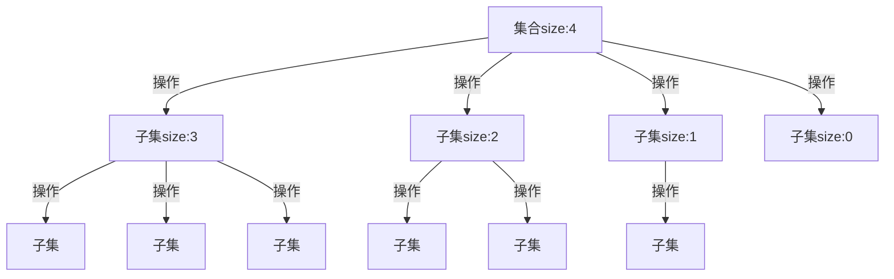
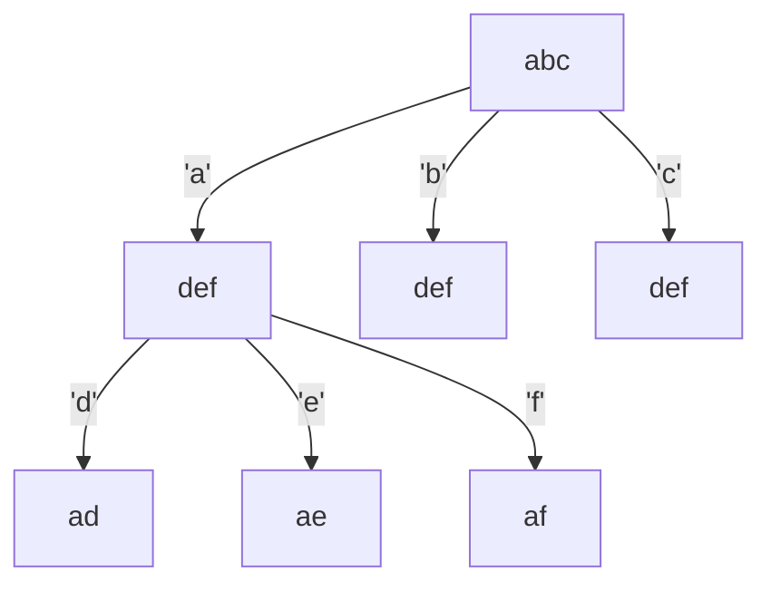
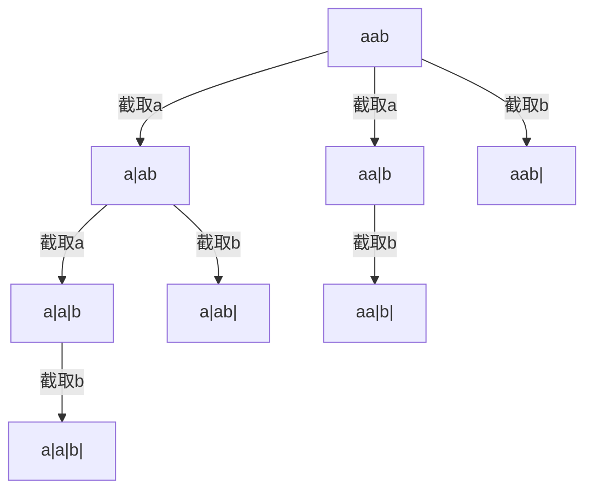

# 回溯算法（画出树状图）
> 回溯的本质就是**穷举**

## 适合的问题
- 组合问题：N个数里面按一定的规则找出k个数的集合
- 切割问题：一个字符串按照一定的规则有几种切割方式
- 子集问题：一个N个数的集合里面有多少符合条件的子集
- 排列问题：N个数按照一定的规则全排列，有多少种排列方式
- 棋盘问题：N皇后，解数独等

组合与排列的区别
- 组合：无序
- 排列：有序

## 理解回溯法
> 抽象为树形结构
> 集合的大小决定数的宽度
> 递归的深度构成数的深度

具体的理解看做题时候的笔记

## 回溯的模板

- 回溯函数（backTracking）返回值与参数
```cpp
	void backTracking(args)
```


- 终止条件
~~~
	if (终止条件)
	{
		存放结果；
		return；
	}
~~~


- 遍历过程

```cpp
	for (选择本层集合元素（数的孩子）)
	{
		处理节点；
		backTracking(路径， 选择列表)； //递归
		回溯，撤销处理结果
	}


```


## 1. 组合问题
### [77. 组合](https://leetcode.cn/problems/combinations/description/)

```cpp
class Solution {
public:
    vector<vector<int>> res;
    vector<int> path;
    void backTracking(int n, const int k, int startIndex) {
        if (path.size() == k)
        {
            res.push_back(path);
            return;
        }
        //当循环控制条件是 i <= n 时
        //会出现剩余元素不够k个的情况 n - startIndex < k
        //那么此时就没必要再递归了
        //笔记中详细分析
        for (int i = startIndex; i <= n - (k - path.size()) + 1; i++)
        {
            path.push_back(i);
            backTracking(n, k, i + 1); //这是回溯的“溯”
            path.pop_back(); //这是回溯的“回”
        }
    }

    vector<vector<int>> combine(int n, int k) {
        backTracking(n, k, 1);
        return res;
    }
};
```
做回溯第一题的感受：
1. if判断回溯结束的条件，**等价于递归时到最底层节点**，这里相当于到了结果集，直接保存结果，输出
2. **for是子集的宽度[a, b]** ,相当于数的每一层节点个数
3. **` backTracking（args）` 体现回溯的“溯”**，往更深一层走
4. **pop操作体现回溯的“回”**, （1，x），1不变，x = 2 记录了以后，删除2，为的是让腾位置让 x = 3


解释为什么这样剪枝：
- 前面提到，for循环是抽象为数的宽度，显然真正控制宽度的，是for循环条件
- 每一层可能的子集（子叶）的取值，就是for的初始值和最终值
- 第一层不剪枝，他的取值是[1,4],但是没必要取到4了，因为子集4没有可能的子集了，不可能有结果集
- 那么他的取值范围应当这么分析：
 	- 已经取了path.size()
 	- 还需要 k - path.size()
 	- 那么当前这一层的宽度最大值只能是`n - (k - path.size()) + 1`
 	- +1 是因为闭区间，边缘是可以取到的


### [216. 组合总和III](https://leetcode.cn/problems/combination-sum-iii/description/)


```cpp
class Solution {
public:
    vector<vector<int>> result;
    vector<int> path;
    int sum = 0;
    void backTracking(int k, int n, int startIndex, int sum) {
        //剪枝
        if (sum > n)
            return;
        if (path.size() == k) {
            if (sum == n) {
                result.push_back(path);
            }
            return;
        }
        for (int i = startIndex; i <= 9 - (k - path.size()) + 1; i++) {
            path.push_back(i);
            sum += i;
            backTracking(k, n, i + 1, sum);
            path.pop_back();
            sum -= i;
        }
    }

    vector<vector<int>> combinationSum3(int k, int n) {
        backTracking(k, n, 1, 0);
        return result;
    }
};
```

和上一题的区别在于这一题回溯过程中需要添加一个sum来判断组合的总和
剪枝：
- 剪枝这里采用的方法和我想的不太一样，这是粗略的剪枝
- 首先是在控制宽度，控制宽度是为了避免出现组合数size不够的情况，仅此而已
- 其次判断了sum大于targetSum的情况
- 我想的是由于数字只能使用一个，如果 sum + （i + 1) ^ 2大于 targetSum，其实i + 1以后都没必要取了
- 这里有一个误区就是剪枝并不是最优化的方法，只是**适当的减轻迭代次数而已**

### [17. 电话号码的字母组合](https://leetcode.cn/problems/letter-combinations-of-a-phone-number/description/)

```cpp
class Solution {
public:
    string numMap[10] =
    {
        "",
        "",
        "abc",
        "def",
        "ghi",
        "jkl",
        "mno",
        "pqrs",
        "tuv",
        "wxyz"
    };
    vector<string> result;
    string path;
    void backTracking(string digits, int index)
    {
        if (path.size() == digits.size())
        {
            result.push_back(path);
            return;
        }
        int num = digits[index] - '0';
        string subStr = numMap[num];
        for (int i = 0; i < subStr.size(); i++)
        {
            path.push_back(subStr[i]);
            backTracking(digits, index + 1);
            path.pop_back();
        }
    }
    vector<string> letterCombinations(string digits) {
        if (digits.size() == 0) return result;
        backTracking(digits, 0);
        return result;
    }
};
```

再次加深理解：
- 每一层集合是子集的取值范围，操作选择哪个数字是 for 循环中的 i 决定
- 不管给的是什么形式的数据，for循环之前要转化成数字集合
- “2”要提前提取出int 2 （’2‘ - ’0‘）
- 再提取出对应集合”abc“，创建string接收


### [39. 组合总和](https://leetcode.cn/problems/combination-sum/)


```cpp
class Solution {
public:
    vector<vector<int>> result;
    vector<int> path;
    int sum = 0;
    void backTracking(vector<int>& candidates, int target, int index, int sum)
    {
        if (sum >= target)
        {
            if (sum == target) result.push_back(path);
            return;
        }

        for (int i = index; i < candidates.size() && sum + candidates[i] <= target; i++)
        {
            path.push_back(candidates[i]);
            sum += candidates[i];
            backTracking(candidates, target, i, sum);
            sum -= candidates[i];
            path.pop_back();
        }
    }
    vector<vector<int>> combinationSum(vector<int>& candidates, int target) {
        result.clear();
        path.clear();
        sort(candidates.begin(), candidates.end());
        backTracking(candidates, target, 0, sum);
        return result;

    }
};
```

- 数据可重复： **回溯的index是i**
- 剪枝：sort（obj.begin(), obj.end()）


### [40. 组合总和 II](https://leetcode.cn/problems/combination-sum-ii/)

- 本题特点：数字可以重复使用，但是组合不能重复
- 子节点可以重复，兄弟节点不能相同

#### 使用状态数组

```cpp
class Solution {
public:
    vector<vector<int>> result;
    vector<int> path;
    int sum = 0;
    void backTracking(vector<int>& candidates, int target, int sum, int index, vector<bool>& status) {
        if (sum == target) {
            result.push_back(path);
            return;
        }
        for (int i = index; i < candidates.size() && sum + candidates[i] <= target; i++) { 
            if (i - 1 >= 0 && candidates[i] == candidates[i - 1] && status[i - 1] == false)
            {
                continue;
            }
            path.push_back(candidates[i]);
            sum += candidates[i];
            status[i] = true;
            backTracking(candidates, target, sum, i + 1, status);
            sum -= candidates[i];
            path.pop_back();
            status[i] = false;
        }
    }

    vector<vector<int>> combinationSum2(vector<int>& candidates, int target) {
        vector<bool> status(candidates.size(), false); 
        path.clear();
        result.clear();
        sort(candidates.begin(), candidates.end());
        backTracking(candidates, target, sum, 0, status);
        return result;
    }
};
```

#### *（tip）使用index

这种方法是针对：初始序列(**有序或者可以重排**)有重复元素，结果数组不允许重复的情况

```cpp
class Solution {
public:
    vector<vector<int>> result;
    vector<int> path;
    int sum = 0;
    void backTracking(vector<int>& candidates, int target, int sum, int index) {
        if (sum == target) {
            result.push_back(path);
            return;
        }
        for (int i = index;
             i < candidates.size() && sum + candidates[i] <= target; i++) {
            if (i > index && candidates[i] == candidates[i - 1]) {
                continue;
            }
            path.push_back(candidates[i]);
            sum += candidates[i];
            backTracking(candidates, target, sum, i + 1);
            sum -= candidates[i];
            path.pop_back();
        }
    }

    vector<vector<int>> combinationSum2(vector<int>& candidates, int target) {
        path.clear();
        result.clear();
        sort(candidates.begin(), candidates.end());
        backTracking(candidates, target, sum, 0);
        return result;
    }
};
```

## 2.切割问题


### *[131. 分割回文串](https://leetcode.cn/problems/palindrome-partitioning/)

截取字串方法：`substr(int startIndex, int len)`

#### 判断回文串：

```cpp
bool isHuiwen(const string& s, int start, int end) {
    for (int i = start, j = end; i < j; i++, j--) {
        if (s[i] != s[j])
            return false;
    }
    return true;
}
```


```cpp
class Solution {
public:
    vector<vector<string>> result;
    vector<string> path;
    bool isHuiwen(const string& s, int start, int end) {
        for (int i = start, j = end; i < j; i++, j--) {
            if (s[i] != s[j])
                return false;
        }
        return true;
    }
    void backTracking(const string& s, int start) {
        if (start >= s.size()) {
            result.push_back(path);
            return;
        }
        for (int i = start; i < s.size(); i++) {
            if (isHuiwen(s, start, i)) {
                string str = s.substr(start, i - start + 1);
                path.push_back(str);
            } else {
                continue;
            }
            backTracking(s, i + 1);
            path.pop_back();
        }
    }
    vector<vector<string>> partition(string s) {
        backTracking(s, 0);
        return result;
    }
};
```


回溯传i + 1 与传stratIndex的区别

- 回溯回来的时候（一次for循环结束），index没有变化，而 i 会自增一




截取过程很像动态规划

- 截取的线就是index
- 循环结束的条件是截取到了最后
- 判断是否是回文的参数是字串的开始和结束的index，使用了`substr方法`


### [93. 复原 IP 地址](https://leetcode.cn/problems/restore-ip-addresses/)

#### 和上一题不同的地方在于：

- 不能开辟新的字符串，要在原数据上修改
  - 插入`insert(迭代器，插入的位置)`
  - 擦除`erase(迭代器，删除的位置)`

#### 判断字串是否合法：

- 需要插入三个点，如果第三个点正好在末尾，`begin = s.size()  > s.size() - 1`,非法
- 剩余元素超过三个，非法
- 0开头，长度不为1
- 数值大于255

```cpp
class Solution {
public:
    vector<string> result;
    bool isValid(const string& s, int begin, int end) {
        if (begin > end)
            return false;
        if (end - begin > 3)
            return false;
        if (s[begin] - '0' == 0 && end > begin)
            return false;
        int num = 0;
        for (int i = begin; i <= end; i++) {
            num = num * 10 + s[i] - '0';
            if (num > 255)
                return false;
        }

        return true;
    }
    void backTracking(string& s, int index, int pointNum) {
        if (pointNum == 3) {
            if (isValid(s, index, s.size() - 1)) {
                result.push_back(s);
                return;
            }
        }
        for (int i = index; i < s.size(); i++) {
            if (isValid(s, index, i)) {
                s.insert(s.begin() + i + 1, '.');
                pointNum++;
                backTracking(s, i + 2, pointNum);
                pointNum--;
                s.erase(s.begin() + i + 1);
            }
        }
    }
    vector<string> restoreIpAddresses(string s) {
        backTracking(s, 0, 0);
        return result;
    }
};
```


## 3.排序问题

### *[491. 非递减子序列](https://leetcode.cn/problems/non-decreasing-subsequences/)

特点：**当前层创建状态数组记录本层情况而不影响下一层**

不能用index来避免重复的原因：

- 因为不能重排还要保证结果是递增序列，会添加保证递增的控制条件，会过滤掉没法处理例如{1，2，3，1，1}的情况，

错误代码

```cpp
for (int i = index; i < nums.size(); i++) {
    if (i - 1 >= index && nums[i] == nums[i - 1])
        continue;
    if (i == 0 || i - 1 >= 0 && nums[i] >= nums[i - 1]) {
        path.push_back(nums[i]);
        backTracking(nums, i + 1);
        path.pop_back();
    }
}
```


输入：[1,2,3,1,1]

输出：[[1,2],[1,2,3],[1,3],[2,3]]

预期结果：[[1,2],[1,2,3],[1,3],[1,1],[1,1,1],[2,3]]

由此可知，`nums[i] >= nums[i - 1]`只和前面一个数比较会漏掉很相隔递增的情况

但是有一个案例没搞明白原因：

[1,2,3,4,5,6,7,8,9,10,1,1,1,1,1]

输出的结果一万多，如果是漏掉情况的话不应该多，应该少才对


```cpp
class Solution {
public:
    vector<vector<int>> res;
    vector<int> path;
    void backTracking(vector<int>& nums, int index) {
        if (path.size() >= 2) {
            res.push_back(path);
        }
        int map[201] = {0}; //[-100,100]做哈希
                            //定义在回溯函数内部，记录**每一层**的元素使用情况
        for (int i = index; i < nums.size(); i++) {
            // if (i - 1 >= index && nums[i] == nums[i - 1])
            //     continue;
            if ((!path.empty() && path.back() > nums[i]) ||
                map[nums[i] + 100] == 1)
                continue;
            map[nums[i] + 100] = 1;
            path.push_back(nums[i]);
            backTracking(nums, i + 1);
            path.pop_back();
        }
    }
    vector<vector<int>> findSubsequences(vector<int>& nums) {
        backTracking(nums, 0);
        return res;
    }
};
```


### [46. 全排列](https://leetcode.cn/problems/permutations/)

特点：**回溯传一个状态数组记录元素使用情况**

```cpp
class Solution {
public:
    vector<vector<int>> res;
    vector<int> path;
    int used_map[21] = {0};
    void backTracking(const vector<int>& nums, int used_map[]) {
        if (path.size() == nums.size()) {
            res.push_back(path);
            return;
        }
        for (int i = 0; i < nums.size(); i++) {
            if (used_map[nums[i] + 10] == 1) {
                continue;
            }
            used_map[nums[i] + 10] = 1;
            path.push_back(nums[i]);
            backTracking(nums, used_map);
            path.pop_back();
            used_map[nums[i] + 10] = 0;
        }
    }

    vector<vector<int>> permute(vector<int>& nums) {
        backTracking(nums, used_map);
        return res;
    }
};
```

#### 番外

函数传数组：

```CPP
int func(int arr[]);
int func(int arr[8]);
int func(int (arr)[8]);
int func(int (arr)[8]);
int func(int *arr);

// 在函数体中
sizeof(arr)/sizeof(arr[0]) == sizeof(int *)
```

传递的只是数组头指针

推荐的传递方法

~~~cpp
//传指针
int func1(int (*arr)[8]);
//传引用
int func2(int (&arr)[8]);

//调用
{
    func1(&arr);
    func2(arr);
}


~~~

上面直接使用`int arr[]`不会影响数组元素的访问，但是数组信息不完整，有风险，丢失了长度信息，具体体现在
- 无法得知arr.size()
- 无法遍历
- 可能会下标溢出


### [47. 全排列 II](https://leetcode.cn/problems/permutations-ii/)

本题特点：有重复元素

- 一个记录本层元素，不重复使用
- 一个记录迭代索引，不重复选取

```cpp
class Solution {
public:
    vector<vector<int>> res;
    vector<int> path;
    int indexUsed[8] = {};
    void backTracking(const vector<int>& nums, int (&indexUsed)[8]) {
        if (path.size() == nums.size()) {
            res.push_back(path);
            return;
        }
        int used[21] = {};
        for (int i = 0; i < nums.size(); i++) {
            if (indexUsed[i] == 1 || used[nums[i] + 10] == 1)
                continue;
            path.push_back(nums[i]);
            used[nums[i] + 10] = 1;
            indexUsed[i] = 1;
            backTracking(nums, indexUsed);
            path.pop_back();
            indexUsed[i] = 0;
        }
    }
    vector<vector<int>> permuteUnique(vector<int>& nums) {
        // sort(nums.begin(), nums.end());
        backTracking(nums, indexUsed);
        return res;
    }
};
```


## 4. 棋盘问题

### [51. N 皇后](https://leetcode.cn/problems/n-queens/)

- 容器初始化方法：括号初始化

- 回溯更新棋盘，棋盘就是一个组合结果，一个path
- isValid函数设计
  - 剪枝只检查当前这一行以上的，因为下面的还没有更新，一定是`"."`

总体思路：

1. 回溯结束条件，已经有了n个皇后，简化为已经回溯了n层，用deep代替
2. 每层处理逻辑：此位置合法就插入，合法性另做判断
3. 合法性判断：行、列、斜都无其他皇后Q
4. 返回值：棋盘记录回溯的结果，结束前将正确的组合插入结果集合


```cpp
class Solution {
public:
    vector<vector<string>> res;

    void backTracking(int n, int deep, vector<string>& chessboard) {
        if (deep == n) {
            res.push_back(chessboard);
            return;
        }
        for (int i = 0; i < n; i++) {
            if (isValid(deep, i, n, chessboard)) {
                chessboard[deep][i] = 'Q';
                backTracking(n, deep + 1, chessboard);
                chessboard[deep][i] = '.';
            }
        }
    }
    bool isValid(int hang, int lie, int n, vector<string> chessboard) {
        // 检查列
        for (int i = 0; i < n; i++) {
            if (chessboard[i][lie] == 'Q')
                return false;
        }
        // 检查45度
        for (int i = hang, j = lie; i >= 0 && j < n; i--, j++) {
            if (chessboard[i][j] == 'Q')
                return false;
        }

        // 检查135度
        for (int i = hang, j = lie; i >= 0 && j >= 0; i--, j--) {
            if (chessboard[i][j] == 'Q')
                return false;
        }

        return true;
    }
    vector<vector<string>> solveNQueens(int n) {
        vector<string> chessboard(n, string(n, '.'));
        backTracking(n, 0, chessboard);
        return res;
    }
};
```

