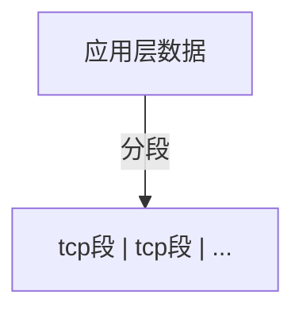

## TCP/IP网络模型有哪几层？

### 应用层

- 应用层为用户提供应用服务，如HTTP,FTP,Telnet,DNS,SMTP
- 与数据如何传输无关
- 工作在操作系统中的用户态，传输层工作在内核态

### 传输层

应用层的数据包会传给传输层，传输层为**应用层提供网络支持**

传输层有两个协议：

1. TCP：传输控制协议（transmission Control Trotocol）
   - 相比于UDP多出的特性：流量控制、超时重传、拥塞控制
   - 保证数据包可靠的传输

2. UDP:只负责发送数据
   - 不保证能够抵达
   - 但 实时性高,传输效率高
   - 也可以实现可靠传输，但是需要在应用层实现tcp的特性

应用传输的数据可能非常大，传输层的数据包大小大于MSS（tcp的最大报文段），传输层就会将数据分段，然后交给网络层,每个段就是TCP段（tcp segment），那个分块发送失败，就会重新发送那个分块。



设备作为接收方时，传输层负责把数据包传给应用，但是一个设备可能有很多应用在接受和传输数据，因此使用端口来编号，传输层的报文中包含端口。

### 网络层
实际传输功能实现在网络层。
最常用的IP协议，IP协议会将传输层的报文作为数据部分，再加上IP包头组层IP报文，如果报文大小超过MTU（一般1500字节），就会进行分片。


```
```

