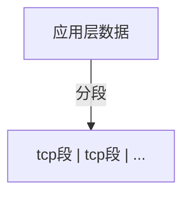
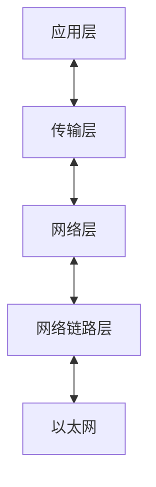
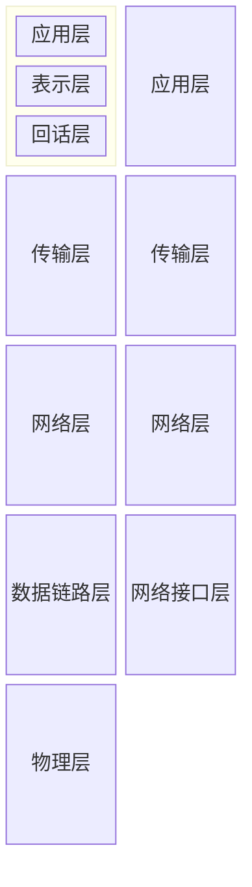

# 小林coding

## TCP/IP网络模型有哪几层？

### 应用层

- 应用层为用户提供应用服务，如HTTP,FTP,Telnet,DNS,SMTP
- 与数据如何传输无关
- 工作在操作系统中的用户态，传输层工作在内核态

### 传输层

应用层的数据包会传给传输层，传输层为**应用层提供网络支持**

传输层有两个协议：

1. TCP：传输控制协议（transmission Control Trotocol）
   - 相比于UDP多出的特性：流量控制、超时重传、拥塞控制
   - 保证数据包可靠的传输

2. UDP:只负责发送数据
   - 不保证能够抵达
   - 但 实时性高,传输效率高
   - 也可以实现可靠传输，但是需要在应用层实现tcp的特性

应用传输的数据可能非常大，传输层的数据包大小大于MSS（tcp的最大报文段），传输层就会将数据分段，然后交给网络层,每个段就是TCP段（tcp segment），那个分块发送失败，就会重新发送那个分块。

设备作为接收方时，传输层负责把数据包传给应用，但是一个设备可能有很多应用在接受和传输数据，因此使用端口来编号，传输层的报文中包含端口。

### 网络层
**实际传输功能实现**在网络层，负责将数据从一个设备传输到另一个设备。
**最常用的IP协议**，IP协议会将传输层的报文作为数据部分，再加上IP包头组层IP报文，如果报文大小超过MTU（一般1500字节），就会进行分片。

网络层-----》传输层《-------》应用层

#### 如何找到对方设备呢？ 分区设备的编码

**IP地址对设备进行编码**: 对于ipv4，ip地址32位，分四段，每段时八位，分成两种含义

- 一个是**网络号**：识别是那个**子网**的
- 一个是**主机号**：负责同一子网下的不同主机

#### 具体怎么分：配合子网掩码
例如：10.100.122.0/24
/24 表示255.255.255.0 子网掩码
与ip进行**按位与**
00001010 01100100 01111010 00000010 <----ip
11111111 11111111 11111111 00000000 <----子网掩码
**00001010 01100100 01111010 00000000**  <----网络号
**00000000 00000000 00000000 00000010**  <----主机号

**先匹配网络号，再寻找对应主机**，除此之外，ip协议还有一个重要功能就是**路由**
实际场景中，两台机器不是通过网线连起来的，而是通过很多网关、路由器、交换机等设备，形成很多网络路径，当数据通过一个网络节点，需要通过**路由算法决定何去何从**

### 网络接口层
网络接口层---》网络层《---》传输层《---》应用层
ip头部中包含的**接收方ip地址，表示网络包要到达的目的地，通过这个来判断包要发送到哪里**，但是再以太网的世界是**行不通**的，为什么？
#### 以太网
以太网就是在 局域网 内，将附近的设备连接起来，是他们之间可以进行通信的技术。

以太网在判断网络包目的地是和ip的方式不同，必须使用**MAC地址**

MAC头部包含了接收方和发送方的MAC地址信息，可以通过**ARP协议**获取对方的地址

所以，**网络接口层主要为网络层提供 链路级别 传输的服务，负责在以太网、wifi这样的底层网络上发送原始数据包**

可以通过`arp -a`查看arp缓存

每一层的封装格式

## Linux是如何收发网络包的

### 网络模型
开放式系统互联网络通信参考模型------OSI模型
共有七层，对比tcp的四层

所谓的四层（传输层）和七层（物理层）负载均衡值得都是OSI模型

### linux网络协议栈

- 应用程序需要通过系统调用来跟socket层进行数据交互
- socket层的下一层就是传输层、网络层和网络接口层
- 最下面一层则是网卡驱动程序和硬件网络设备

### linux接收网络包的流程

网卡负责接收和发送网络包，当网卡接收到网络包以后，会通过DMA技术，将网络包写入Ring Buffer，这是一个环形缓冲区，接着告诉操作系统这个网络包已经到达。

> 如何告诉系统？

最简单的方式就是**触发中断**，但是存在一个问题：在高性能网络成惊吓，网络包的数量非常多，就会频繁触发中断，cpu忙于处理中断就会影响系统的整体效率

所以Linux内核2.6版本引入**NAPI机制**，它是混合**中断和轮询**的方式接收网络包，核心是**不采用中断的方式读取数据**，而是**首先采用中断唤醒数据接收的服务程序，然后poll的方法来轮询数据**

**总的来说**：当网络包到达以后，会通过DMA技术，将网络包写入指定的内存地址，然后网卡向cpu发起硬件中断，cpu接收到请求后根据中断表，调用已经注册的中断处理函数

- 硬件中断处理函数会做如下内容：

  - 需要先暂时屏蔽中断，表示已经知道内存中有数据了，告诉网卡下次再收到数据包直接写入内存就可以了，不再需要通知cpu，避免cpu频繁被中断
  - 接着发起软中断，恢复刚才被屏蔽的中断

- 软中断处理
  内核中的ksoftirpd线程专门负责处理软中断，会轮询处理数据，重Ring Buffer中获取一个数据帧用sk_buff

  表示，从而可以作为一个网络包交给网络协议栈逐层处理

- 网络协议栈

  - 首先会进入**网络接口层**，检查报文的合法性，如果不合法则丢弃，合法则找出这个包的上层协议类型（是ipv4还是ipv6），接着去掉帧头和帧尾，交给**网络层**
  - 到了**网络层**， 则取出IP包，判断网络包的下一步去向，是交给上层处理还是转发出去，当确认网络包要发给本机以后，就会中IP头看上一层的协议类型是TCP还是UDP，接着去掉IP头，交给传输层
  - **传输层**取出TCP或者UDP头，根据四元组「源 IP、源端口、目的 IP、目的端口」作为标识，找出相应的Socket，并把数据放到Socket缓冲区
  - 最后，**应用层**调用socket接口，将内核socket接收缓冲区的数据拷贝到应用层缓冲区，然后唤醒用户线程

至此，网络包的接收过程就结束了

### Linux发送网络包的流程

- 应用程序会调用socket发送数据包的接口，由于用户会陷入到内核态的socket层，内核会申请一个内核态的sk_buff内存，将用户待发送的数据拷贝到sk_buff,并将其加入到发送缓冲区
- 网络协议栈从socket取出sk_buff，并按照TCP/IP协议栈从上往下处理

如果使用的是TCP，内核在每次调用网卡发送之前会先**拷贝一个sk_buff副本**，实际传递的是**副本**，等接受到对方的ACK之后在真正删除

> 因为网卡发送完会释放sk_buff？所以呢，他留着还有什么其他的用处？
>
> 后面讲到了，层层处理的都是这个sk_buff,依靠这个结构体里的data指针移动来实现添加头部和去除头部

- sk_buff填充tcp的头部，在不同不层级有不用的名字
  - 应用层叫data
  - tcp层叫segment
  - ip层叫packet
  - 数据链路层叫frame

发送报文是，sk_buff结构体中data指针的移动过程：

至此，传输层的任务完成了

- 网络层会选取路由、填充ip头、netfilter过滤、切片，然后交给网络接口层
- 网络结构层会通过ARP协议获得下一跳的MAC地址，然后对sk_buff填充帧头和帧尾，接着将sk_buff放到网卡的发送队列中
- 完成准备工作后，会触发软中断，告诉网卡驱动有网络包需要发送，驱动程序会从队列中读取sk_buff，挂到Ring Buffer中，接着将sk_buff数据映射到网卡可以访问的DMA区域，最后触发真实的发送
- 发送完成后需要清理内存，网卡会触发一个硬中断来释放内存，是要是释放sk_buff 和Ring Buffer
- 当接收到TCP报文的ACK应答时，传输层就会释放**原始的sk_buff**

#### 发送数据包的过程中涉及了几次内存拷贝？

1. 发送数据系统调用的时候，内核会申请一个内核态的sk_buff内存，**将用户数据拷贝到sk_buff**
2. 在从传输层进入网络层的时候，会**拷贝sk_buff，并将副本发送到网络层**，发送完成就会**释放副本**，原始的skbuff依然保存，在收到TCP报文的ACK应答时，**释放原始skbuff**
3. 当IP层发现skbuff大于MTU是会额外申请skbuff，并**将原来的skbuff拷贝为多个小的skbuff**

## 键入网址到网页显示，期间发生了什么？
### HTTP
1. 浏览器第一步工作就是解析URL
解析URL从而生成发给Web服务器的请求信息。

2. 生产HTTP请求信息
对URL解析以后，浏览器确定了Web服务器和文件名，接下来就是根据这些信息生成HTTP请求消息

**请求报文：** 

请求行 换行

消息头 换行

换行

消息体

**响应报文：**

状态行

消息头（若干个）换行

换行

消息体 

### 真实地址查询 DNS

通过浏览器解析URL并生成HTTP消息后，需要委托操作系统将消息发送给Web服务器

在此之前，还需要查询服务器域名对应的IP地址

有一种服务器，**专门保存web服务器域名和ip的对应关系，这就是DNS服务器**

1. 域名的层级关系

在域名中，**越靠右表示的层级越高**

域名后面还有一个隐藏的点，`www.baidu.com.`最后一个点表示根域名，当我们试图访问的时候

域名的层级关系类似一个树状结构：

- 根DNS服务区（.）
- 顶级域DNS服务器（.com）
- 权威DNS服务器（server.com）

根域的DNS服务器保存在互联网中所有的DNS服务器中，这样任何DNS服务器都可以找到并且访问根域服务器，然后顺藤摸瓜找到目标服务器。

2. 域名解析流程
   1. 服务端首先发出一个DNS请求，询问`www.server.com`的IP，并发给本地DNS服务器
   2. **如果本地服务器能够在缓存表里找到，则直接返回询问的IP地址**，否则会询问根服务器，根域名好服务器是最高层级，不直接用于域名解析，但是可以指明方向
   3. 根DNS收到本地DNS请求后，发现是.com的后缀，会发送给本地.com的服务器地址
   4. 本地收到.com地址后向.com顶级服务器询问`www.server.com`的地址
   5. 顶级服务器收到后回复server.com权威服务器地址
   6. 本地继续向权威服务器询问
   7. **权威服务器是域名解析结果的原出处**，将`www.server.com`地址返回本地
   8. 本地再将ip地址返回客户端，客户端和目标建立连接

**总结**就是**客户端**想要得到`www.server.com`的IP地址，如果**本地服务器**的缓存里有，则直接提供给客户端

否则的话，客户端会从.到.com 到server.com层层询问，直到由**权威服务器**告诉本地`www.server.com`的IP地址，本地服务器在告诉**客户端与目标建立连接**

3. 至此数据包找到了目的地，但是如何发送呢？

### 协议栈

通过DNS获取IP地址后，把HTTP的传输交给操作系统的协议栈处理

应用程序通过调用socket库，来委托协议栈工作，协议栈上半部分有两块，分别是TCP和UDP协议，负责接收应用层的委托，执行数据收发

下半部分是用IP协议控制网络包的收发操作，包括两块：

- ICMP用于告知网络包传送过程中产生的错误以及各种控制信息
- APR负责根据IP查询MAC地址

网卡驱动程序负责控制网卡硬件，最下面的网卡实际完成收发操作，也就执行发送和接受的网络信号

### 可靠传输 TCP

1. **TCP报文格式**

- 源端口号：识别报文返回地址

- 目标端口号：指明目标计算机的应用程序接口
- 序列号：识别源端向目标发送的字节流，**解决包乱序的问题**
- URG: 紧急标志位，说明紧急指针有效
- ACK:确认标志位，默认为空，表示序号有效，1表示应答字段有效（应答包包含在tcp段中）
- PSH:置为1表示接收方应该立即请求将报文交给应用层
- RST:复位，用于复位产生错误的连接，或者拒接接收错误和非法包
- SYN:同步，仅在三次握手联立连接时有效
- FIN:数据发送完成断开连接

- 窗口大小：流量控制，表示处理能力
- 校验和：强制性字节，发送端计算，接收端校验
- 紧急指针：指向数据中优先部分的最后一个字节，在URG控制
- 选项：通常包含报文大小、窗口扩大选项、时间戳选项、选择性确认等

~~拥塞控制~~

2. **TCP传输数据前需要三次握手建立连接**

双方计算机里维护一个状态机，在建立连接的过程中，双方的状态变化如图

[简单理解TCP三次握手四次挥手（看一遍你就懂）-CSDN博客](https://blog.csdn.net/m0_56649557/article/details/119492899)

举个栗子
公安局长王哥 和 陈某打电话

公安局：你好！陈某，听得到吗？（一次会话）
陈某：听到了，王哥，你能听到吗 （二次会话）
公安局：听到了，你过来自首吧 （开始会话）（三次会话）

最开始的时候客户端和服务器都是处于CLOSED关闭状态。主动打开连接的为客户端，被动打开连接的是服务器。

TCP服务器进程先创建传输控制块TCB，时刻准备接受客户进程的连接请求，此时服务器就进入了 LISTEN 监听状态

- 第一次握手 TCP客户进程也是先创建传输控制块TCB，然后向服务器发出连接请求报文，这是报文首部中的同部位SYN=1，同时选择一个初始序列号 seq=x ，此时，TCP客户端进程进入了 SYN-SENT 同步已发送状态

- 第二次握手 TCP服务器收到请求报文后，如果同意连接，则会向客户端发出确认报文。确认报文中应该 ACK=1，SYN=1，确认号是ack=x+1，同时也要为自己初始化一个序列号 seq=y，此时，TCP服务器进程进入了 SYN-RCVD 同步收到状态

- 第三次握手 TCP客户端收到确认后，还要向服务器给出确认。确认报文的ACK=1，ack=y+1，自己的序列号seq=x+1，此时，TCP连接建立，客户端进入ESTABLISHED已建立连接状态 触发三次握手

有人可能会很疑惑**为什么要进行第三次握手？**
主要原因：**防止已经失效的连接请求报文突然又传送到了服务器**，从而产生错误

- 第一次握手： 客户端向服务器端发送报文
  证明客户端的发送能力正常
- 第二次握手：服务器端接收到报文并向客户端发送报文
  证明服务器端的接收能力、发送能力正常
- 第三次握手：客户端向服务器发送报文
  证明客户端的接收能力正常

**如果采用两次握手会出现以下情况：**
客户端向服务器端发送的请求报文由于网络等原因滞留，未能发送到服务器端，此时连接请求报文失效，客户端会再次向服务器端发送请求报文，之后与服务器端建立连接，当连接释放后，由于网络通畅了，第一次客户端发送的请求报文又突然到达了服务器端，这条请求报文本该失效了，但此时服务器端误认为客户端又发送了一次连接请求，两次握手建立好连接，此时客户端忽略服务器端发来的确认，也不发送数据，造成不必要的错误和网络资源的浪费。

如果采用三次握手的话，就算那条失效的报文发送到服务器端，服务器端确认并向客户端发送报文，但此时客户端不会发出确认，由于客户端没有确认，由于服务器端没有接收到确认，就会知道客户端没有请求连接。

### TCP四次挥手

建立TCP连接需要三次握手，终止TCP连接需要四次挥手

举个例子
张三和李四的对话

张三：好的，那我先走了
李四：好的，那你走吧
李四：那我也走了？
张三：好的，你走吧

数据传输完毕后，双方都可释放连接。最开始的时候，客户端和服务器都是处于ESTABLISHED状态，然后客户端主动关闭，服务器被动关闭。

第一次挥手 客户端发出连接释放报文，并且停止发送数据。释放数据报文首部，FIN=1，其序列号为seq=u（等于前面已经传送过来的数据的最后一个字节的序号加1），此时，客户端进入FIN-WAIT-1（终止等待1）状态

第二次挥手 服务器端接收到连接释放报文后，发出确认报文，ACK=1，ack=u+1，并且带上自己的序列号seq=v，此时，服务端就进入了CLOSE-WAIT 关闭等待状态

第三次挥手 客户端接收到服务器端的确认请求后，客户端就会进入FIN-WAIT-2（终止等待2）状态，等待服务器发送连接释放报文，服务器将最后的数据发送完毕后，就向客户端发送连接释放报文，服务器就进入了LAST-ACK（最后确认）状态，等待客户端的确认。

第四次挥手 客户端收到服务器的连接释放报文后，必须发出确认，ACK=1，ack=w+1，而自己的序列号是seq=u+1，此时，客户端就进入了TIME-WAIT（时间等待）状态，但此时TCP连接还未终止，必须要经过2MSL后（最长报文寿命MSL），当客户端撤销相应的TCB后，客户端才会进入CLOSED关闭状态，服务器端接收到确认报文后，会立即进入CLOSED关闭状态，到这里TCP连接就断开了，四次挥手完成

为什么客户端要等待2MSL？
主要原因是为了保证客户端发送那个的第一个ACK报文能到到服务器，因为这个ACK报文可能丢失，并且2MSL是大于任何报文在网络上存在的最长时间，超过这个时间报文将被丢弃，这样新的连接中不会出现旧连接的请求报文。

------------------------------------------------

                            版权声明：本文为博主原创文章，遵循 CC 4.0 BY-SA 版权协议，转载请附上原文出处链接和本声明。

原文链接：https://blog.csdn.net/m0_56649557/article/details/119492899 

3. TCP分割数据
4. TCP报文生成

TCP报文中的数据部分就存放HTTP头部+数据，组装好以后就交给网络层处理

# 补充

[面试题：每发送一个http请求就要建立一个tcp连接吗（非持久连接/持久连接）_发一次数据包就要进行一次tcp连接吗-CSDN博客](https://blog.csdn.net/qq_44918090/article/details/120757316#:~:text=非持久连接： HTTP%2F1.0 中 的首部字段 Connection 默认值为 close，即每次请求都会重新建立和断开 TCP,持久连接： HTTP%2F1.1 中 的首部字段 Connection 默认值为 keep-alive ，连接可以复用，只要发送端、接收端都没有提出断开连接，则保持tcp连接状态。)

## 每发送一个http请求就要建立一个tcp连接吗
### 非持久连接和持久连接

- 非持久连接：在HTTP/1.0中首部字段close，**每次请求都会重现建立和断开TCP连接**

- 持久连接：http/1.1中Connection默认值已经修改为keep-alive，**连接可以复用，只要双端都没有提出断开连接，则保持tcp连接状态**

持久连接优点：减少tcp连接的重复建立和断开的开销，减轻了服务器的负担，实际上也使http请求和相应更早结束，
